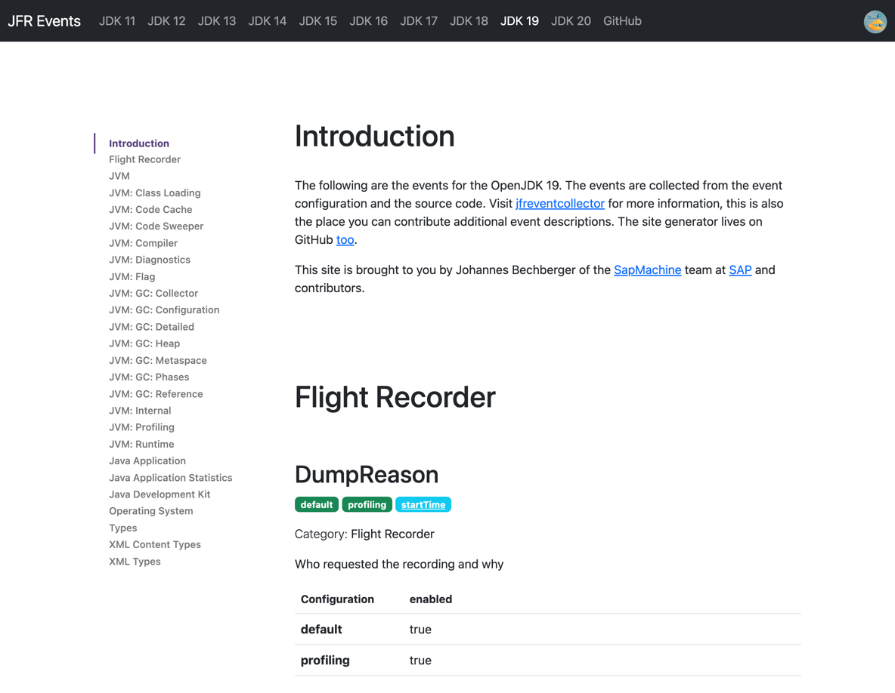

JFR Events Site Generator
=========================

Uses the data from the [jfreventscollector](https://github.com/parttimenerd/jfreventcollector)
project to generate a website with all the JFR events seen at [SapMachine](https://sapmachine.io/jfrevents).



Build
-----
```shell
# update the dependencies
mvn dependency:resolve -U
mvn clean package assembly:single
# generate it into site
java -jar target/jfrevents-site-generator-full.jar site
```

Site generator options:

```
Usage: generator [-hV] [-p=<prefix>] [--goat-counter-url
                 [=<goatCounterUrls>...]]... <target>
Generates a site with specified parameters.
      <target>            The target directory.
      --goat-counter-url[=<goatCounterUrls>...]
                          GoatCounter is an open source web analytics platform.
                            This is the URL for GoatCounter.
  -h, --help              Show this help message and exit.
  -p, --prefix=<prefix>   The filename prefix.
  -V, --version           Print version information and exit.
```

Development
-----------
`WatchKt` builds the version 21 of the site (currently `index.html`) every time the resources change.

`bin/publish.py` is used to publish the site at [sapmachine.io/jfrevents](https://sapmachine.io/jfrevents).

Use `bin/publish.py all` to create and publish the site.

License
-------
Apache 2.0, Copyright 2023 SAP SE or an SAP affiliate company,
Johannes Bechberger and contributors